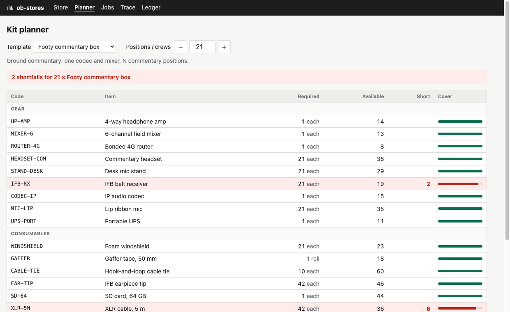

# ob-stores

An equipment store for a regional radio station's outside broadcast team. It holds serialised gear (codecs, mixers, commentary headsets) and consumables received in lots (batteries, cables, tape). A kit template such as *Footy commentary box* has a two-level recipe. Packing a job checks out specific serials and consumes consumables oldest lot first, and returning a job brings the gear back in. Every movement is traceable.

The app uses **vanilla PHP 8.4 and MySQL 8.4**, with no framework and no ORM. It has a legacy screen (server-rendered PHP with jQuery) and a modern screen (a Vue 3 single-file component built by Vite), and both call the same JSON API.

> I wanted to exercise the same primitives an ERP needs (kits built from a bill of materials, an auditable stock ledger, lot and serial traceability, and a legacy screen next to a modern one) in a world I know from broadcast.

**Live demo:** <https://web-production-d36e98.up.railway.app> (Railway free tier: it sleeps when idle, so the first request can take a few seconds; hosted in US West, so pages are slower than the local numbers below)



## Run it

You need PHP 8.4, Composer, Node 22+ and Docker.

```bash
cp .env.example .env && docker compose up -d
composer install && npm ci && npm run build
php bin/seed.php
php -S localhost:8000 -t public
```

Open <http://localhost:8000>. The seeder rebuilds the database with 18 months of invented history (about 25 s). Run the tests with `composer test`.

## Measured

These numbers come from `php bin/bench.php`, which seeds its own copy of the data. The data is 27.8k ledger rows, 790 jobs, 189 lots and 300 serialised items. The machine is an M-series Mac running PHP 8.4.26 against MySQL 8.4.11 in Docker, and every time includes the round trip to MySQL.

| Operation | Median | p95 |
|---|---|---|
| Recipe explosion (Footy box × 3: recursive CTE + live availability) | 7.8 ms | 9.7 ms |
| Store screen (gear summary + consumables, both derived from the ledger) | 10.4 ms | 13.1 ms |
| Ledger page, unfiltered (running-balance window over every movement) | 52 ms | 67 ms |
| Ledger page, one serial | 3.6 ms | 6.7 ms |
| Pack a job (17 serials + 6 consumables: locks, FIFO allocation, 24 inserts, commit) | 53 ms | 79 ms |

`EXPLAIN ANALYZE` shows the recursive part of the explosion takes about 0.7 ms. Nearly all of the rest is the availability lookup through the ledger views, which is the first thing to optimise if stock ever grows large.

`php bin/race.php` forks two processes that pack the same kit at the same instant, when there is only enough gear for one:

```
19 IFB receivers available. Each crew packs a Footy box × 10, so only one can succeed.

Crew A  packed job #691 in 146 ms
Crew B  refused after 195 ms, nothing taken: Not enough stock: IFB-RX (1 short)
```

## Where to look

| What | File |
|---|---|
| Front controller and the 53-line router | [`public/index.php`](public/index.php), [`src/Http/Router.php`](src/Http/Router.php) |
| Pack a job: one transaction, `SELECT … FOR UPDATE`, oldest lot first, clean rollback | [`src/Service/PackJob.php`](src/Service/PackJob.php) |
| Recipe explosion: one `WITH RECURSIVE` query | [`src/Service/RecipeExploder.php`](src/Service/RecipeExploder.php) |
| Append-only ledger: schema, `CHECK` constraints, triggers that refuse `UPDATE` and `DELETE` | [`database/migrations/001_init.sql`](database/migrations/001_init.sql) |
| Current state derived from the ledger | [`database/migrations/002_views.sql`](database/migrations/002_views.sql) |
| Legacy screen (jQuery 3.7) | [`templates/store.php`](templates/store.php), [`public/assets/legacy/store.js`](public/assets/legacy/store.js) |
| Modern screen (Vue 3.5, `<script setup>`) | [`frontend/planner/Planner.vue`](frontend/planner/Planner.vue) |
| Tests (real MySQL, no mocks) | [`tests/Integration/`](tests/Integration) |
| Every judgement call, and each PHP 8.4 / MySQL 8 feature used | [`DECISIONS.md`](DECISIONS.md) |

Other things the code does:
- **Security:** prepared statements everywhere, with emulated prepares off. All output goes through one `e()` helper, and there's a CSRF token on every POST.
- **PHP 8.4 features:** a backed enum for movement type, a property hook, asymmetric visibility, and `new` without extra parentheses.

## Moving a jQuery screen to Vue, one screen at a time

The two screens here are that migration at the halfway point:

1. **API first.** Give the old screen a JSON endpoint and move it onto that endpoint before touching the UI. The store's receive modal already posts to `/api/receipts`, the same endpoint any Vue version would call. The backend then doesn't care which generation of front end calls it.
2. **Mount, don't rewrite the page.** PHP still renders the layout, navigation and CSRF token, and a Vue component mounts on one element (`#planner`). Vite writes a manifest, and a ten-line PHP helper prints the hashed `<script>` tag. There's no SPA router and no second server.
3. **Swap one screen at a time.** Replace `store.php` and `store.js` with a `Store.vue` mounted on `#store`, keep the same endpoints, delete the jQuery file, and ship. The other screens keep working throughout.
4. **Share what both need.** The CSRF token, the stylesheet and the keyboard shortcuts are plain PHP, CSS and JavaScript that either generation can use.

The job return form is deliberately a third generation: a plain HTML form POST with no JavaScript, backed by the same `ReturnJob` service.

## Scope

Deliberately out of scope: users and auth, booking calendars, pricing, customers, multiple stores, maintenance and repair, file uploads, email, a template editor (templates are seeded), and deployment. All names in the seed data are invented.
